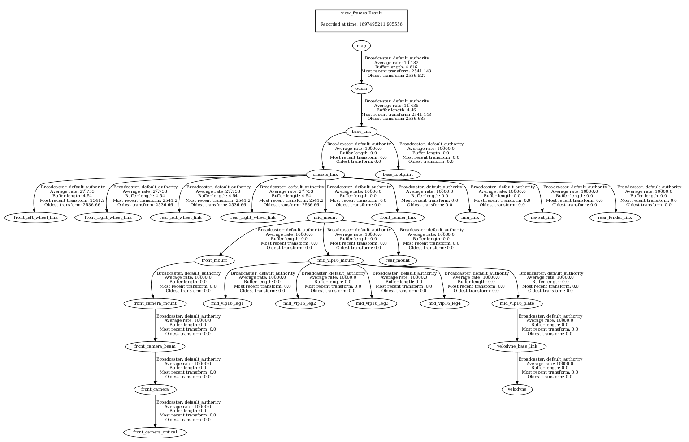

# PECORE 🤖
This repository contains the code, assignments, and projects related to the Master's course on Perception and Cognition in Robotic Exploration (Percepció i Cognició en l'Exploració Robòtica - PECORE) offered at UPC-ETSEIB. The course explores the fundamental concepts, algorithms, and methodologies in robot perception, cognition, and exploration. The repository aims to serve as a resource for students, educators, and practitioners in the field of robotics and autonomous systems. It includes implementations and solutions developed in ROS 2 and other relevant frameworks and tools, covering a range of topics such as sensor processing, mapping, localization, planning, and decision-making in robotic systems.

To complement the developed code please download the remaining dependencies where the simulations, robot configs, etc. are stored: [Download Dependencies](https://asantamarianavarro.gitlab.io/teaching/muar/pecore/src-files/pecore_2023.zip)

For more information about this exercises follow this [tutorial](https://asantamarianavarro.gitlab.io/teaching/muar/pecore/t1.intro_ros/basic/basic.html).


## Exercise 1: Simple Position Control Loop - PUBVEL Package

In this exercise, we are required to close a simple position control loop by sending velocity commands to the robot. The steps involved are as follows:

1. **Service Client Creation**:
   - Inside the `pubvel` node, create a service client to obtain the "ground-truth" pose of the robot.
   - Subscribe to the `/gazebo/get_entity_state` service.
   - In the service call, use "jackal" as the entity name and "world" as the reference frame.

2. **Desired Position**:
   - Set a hardcoded desired position for the robot in the world frame.
   - Compute the error vector between the current and desired positions.

3. **Closed loop and PID control**:
   - Set up and tune a PID to aquire the desired target pose.
   
4. **Usage**:
   - Execute the simulation:
   ```console
   ros2 launch pecore_launch tutorial1b.launch.py
   ```
   - Execute the controller:
   ```console
   ros2 launch pubvel velocity_publisher_launch.py
   ```

## Exercise 2: TF transformations usage - tf_transformations Package
In this exercise, we delve into the world of transformations and leverage ground truth data provided by the Gazebo simulation to concatenate TFs (Transformation Frames). The primary objective is to find the transformation map_H_odom by concatenating the known transformations map_H_baselink (provided by Gazebo) and odom_H_baselink (obtained through a TF listener).

The steps to achieve this are:

1. **Service Client for Ground Truth:**
    A service client is set up to communicate with the /gazebo/get_entity_state service.
    This service provides the true position and orientation of the Jackal robot in the simulated world, referenced as map_H_baselink
2. **TF Listener for odom_H_baselink:**
    A TF listener is created that waits and retrieves the transformation between the odom frame and the base_link frame (odom_H_baselink)
3. **Transformation Matrix Calculation:**
    For both transformations, we convert the transformations from TransformStamped format to a 4x4 transformation matrix.
    This is achieved through the calculate_transformation_matrix function, which takes in translation and rotation components and generates the respectivtransformation matrix
4. **Concatenate TFs to Obtain map_H_odom:**
    Using matrix multiplication and inversion, the transformation map_H_odom is obtained.
    Formula: map_H_odom=map_H_baselink×inv(odom_H_baselink)map_H_odom=map_H_baselink×inv(odom_H_baselink
5. **Broadcast the New Transformation:**
    The obtained map_H_odom matrix is converted back into a TransformStamped format and then broadcasted using a TF broadcaster.
    If performed correctly, when you set the map as the fixed frame in RVIZ, you should be able to visualize all the robot's data seamlessly
6. **Usage:**
    To execute the launch:
   ```console
   ros2 launch tf_transformations tutorial2.launch.py
   ```

   